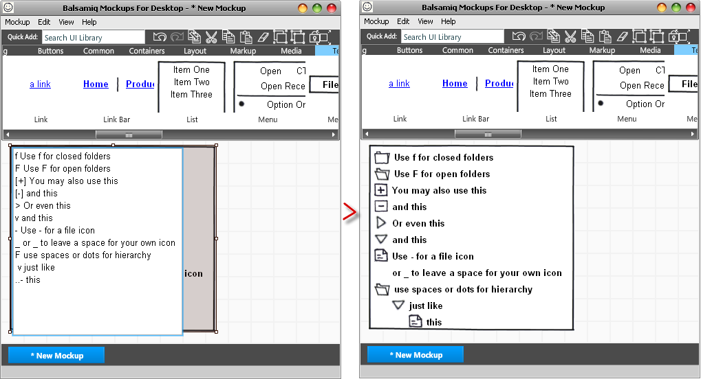
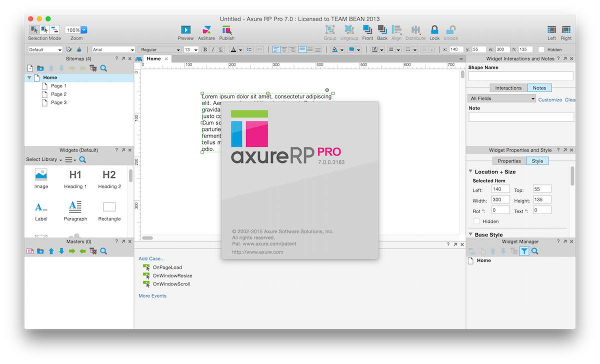

# Xinjie
信杰包装工贸有限公司项目  
##文档
 - [合同](/DOC/合同.md)  
 - 需求分析书  
 - 需求说明书  
 - 设计说明书  
 - 详细设计说明书  

###工具  
 - 原型建立  
  1. Balsamiq Mockups 制作界面原型的软件，手绘风格的、轻量级的软件。  
  2. Axure RP 专业的快速原型设计工具。，让负责定义需求和规格、设计功能和界面的专家能够快速创建应用软件或Web网站的线框图、流程图、原型和规格说明文档。  
  3. 流程图  Shapes，Axure RP 
  4. 框架 ThinkPHP
  5. 代码编辑 PHPStorm